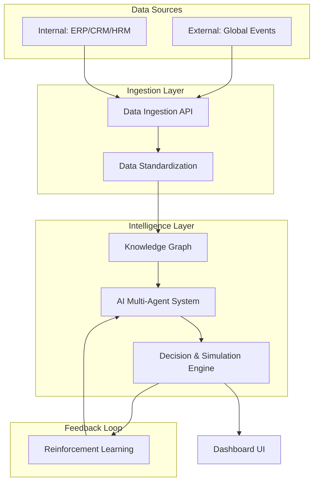
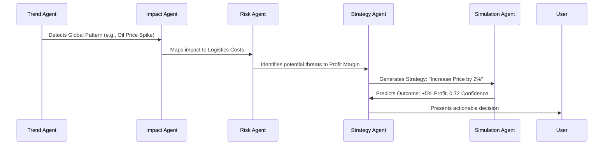

# AI-powered Consultant for Enterprises

A self-learning, domain-agnostic AI decision intelligence platform that continuously transforms internal and global data into actionable business strategy.

> "An AI that monitors your business, understands the world, suggests decisions, and learns from your actions—every single day."

---

## Technical Problem Statement
Modern enterprises face significant challenges in decision-making:
- **Fragmented Data**: Information is often siloed across Finance (ERP), HR (HRM), and Sales (CRM), lacking a unified intelligence layer.
- **Reactive Strategy**: Decisions are traditionally made after impact occurs, as there is no system connecting global events to internal company impact.
- **Inadequate Scenario Testing**: Absence of tools to simulate critical scenarios (e.g., "What if costs increase?" or "What if demand drops?").
- **Static Intelligence**: Traditional BI tools show what *happened* but fail to predict what *will* happen or recommend what *should* be done.
- **Broken Learning Loops**: Past decisions are not systematically utilized to improve future predictive accuracy.

## Solution Architecture
The platform is a domain-agnostic AI consultant designed to ingest internal and global data, analyze impacts, generate decision strategies, and simulate outcomes.

### Core Capabilities
| Capability | Description |
| :--- | :--- |
| **Real-time Intelligence** | Continuous updates to insights based on real-time data feeds. |
| **Multi-Decision Output** | Generation of multiple strategic options with associated risk profiles. |
| **Scenario Simulation** | Prediction of outcomes before execution using probabilistic modeling. |
| **Reinforcement Learning**| Continuous model improvement based on user actions and historical outcomes. |
| **Generic Architecture** | Industry-independent design via a Universal Entity Model. |

---

## Detailed System Architecture

### Data Processing Pipeline
The following diagram illustrates the flow from raw data ingestion to the unified dashboard visualization.



### AI Multi-Agent Interaction
Our system utilizes a specialized multi-agent architecture where agents collaborate to derive strategy from raw data.



---

## Data Modeling

### Universal Entity Model
To remain domain-agnostic, the platform uses a generic schema to represent various business metrics and resources.

```json
{
  "entities": [
    {"name": "Revenue", "type": "metric"},
    {"name": "Cost", "type": "metric"},
    {"name": "Employees", "type": "resource"}
  ],
  "relationships": [
    {"from": "Cost", "to": "Profit", "type": "inverse"},
    {"from": "Employees", "to": "Revenue", "type": "influence"}
  ]
}
```

### Event-Based Modeling
Global signals are converted into impact vectors that influence internal metrics.

```json
{
  "event": "Oil Price Increase",
  "impact_vector": {
    "Logistics Cost": +0.3
  }
}
```

---

## Tech Stack & Implementation
- **Frontend**: React with Vite for a high-performance, reactive UI.
- **Backend**: Node.js and Express for the core API and data orchestration.
- **Workflow**: Integrated development environment managed via `concurrently`.

### Quick Start
1. **Dependency Installation**:
   ```bash
   npm run install-all
   ```
2. **Unified Development Launch**:
   ```bash
   npm start
   ```

---

## Phased Implementation Roadmap
- **Phase 1 (MVP)**: Centralized data upload, basic KPI generation, and static rule-based recommendations.
- **Phase 2**: Integration of real-time global event feeds and the multi-agent orchestration layer.
- **Phase 3**: Full implementation of the Scenario Simulation Engine with probabilistic modeling.
- **Phase 4**: Reinforcement Learning systems to enable autonomous decision refinement.