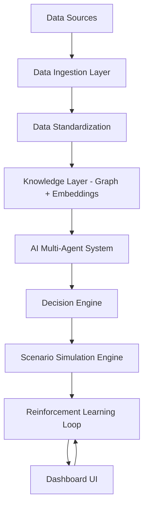

# AI-powered Consultant for Enterprises 🤖💼

A self-learning, domain-agnostic AI decision intelligence platform that continuously transforms internal and global data into actionable business strategy.

> "An AI that monitors your business, understands the world, suggests decisions, and learns from your actions—every single day."

---

## 🚨 Problem Statement
Modern companies face several critical challenges in decision-making:
- **Fragmented Data**: Siloed across Finance (ERP), HR (HRM), and Sales (CRM) with no unified intelligence layer.
- **Reactive Strategy**: Decisions are made *after* impact occurs, with no connection between global events and company impact.
- **Lack of Scenario Testing**: Inability to simulate "What if?" scenarios (e.g., cost increases, demand drops).
- **Static BI Tools**: Traditional dashboards show what *happened*, but don't answer what *will* happen or what *should* be done.
- **No Learning Loop**: Past decisions are rarely used systematically to improve future ones.

## 🎯 Solution Overview
Our AI Consultant is a domain-agnostic engine that continuously:
1. **Ingests**: Internal data (ERP/CRM) + Global signals (Economic/Political).
2. **Analyzes**: Maps global events to specific company impacts using a Knowledge Graph.
3. **Generates**: Provides multiple strategic options with confidence scores.
4. **Simulates**: Predicts outcomes using Probabilistic modeling and Monte Carlo simulations.
5. **Learns**: Uses Reinforcement Learning to improve recommendations based on user actions.

### 🧠 Core Capabilities
| Capability | Description |
| :--- | :--- |
| **Real-time Intelligence** | Continuously updates insights based on live data feeds. |
| **Multi-Decision Output** | Provides multiple strategic options tailored to the context. |
| **Scenario Simulation** | Predicts outcomes before execution to minimize risk. |
| **Reinforcement Learning**| Learns from every decision made over time to refine accuracy. |
| **Generic Architecture** | Works for any industry through a Universal Entity Model. |

---

## 🧩 System Architecture


---

## ⚙️ Core Engine Components
### 1. Knowledge Graph Engine
Represents company structure and dependencies (e.g., *Oil Price ↑ → Logistics Cost ↑ → Profit ↓*).

### 2. AI Multi-Agent System
- **Trend Agent**: Detects global patterns.
- **Impact Agent**: Maps effects to the company.
- **Risk Agent**: Identifies potential threats.
- **Strategy Agent**: Generates actionable decisions.
- **Simulation Agent**: Predicts outcomes of strategies.

### 3. Scenario Simulation Engine
Utilizes Monte Carlo simulations and graph propagation to forecast Best, Expected, and Worst-case outcomes.

---

## 🛠️ Tech Stack & Implementation
### Current Stack:
- **Frontend**: React + Vite
- **Backend**: Node.js + Express
- **Integration**: `concurrently` for unified development workflow.

### Quick Start:
1. **Install Dependencies**:
   ```bash
   npm run install-all
   ```
2. **Start Development Servers**:
   ```bash
   npm start
   ```

---

## 🚀 Phased Implementation Plan
- **Phase 1 (MVP)**: Data upload, Basic KPIs, and Static recommendations.
- **Phase 2**: Real-time event integration and Multi-agent system.
- **Phase 3**: Scenario simulation engine implementation.
- **Phase 4**: Reinforcement learning and autonomous loops.

---

## 🔐 Data Security
- **Encryption**: TLS 1.3 for ingestion, AES-256 for storage.
- **Access Control**: RBAC and data masking for PII/Salaries.
- **Architecture**: Secure API Gateway with multi-tenant isolation.

---
Developed with ❤️ by [MADHAVAN200](https://github.com/MADHAVAN200)
