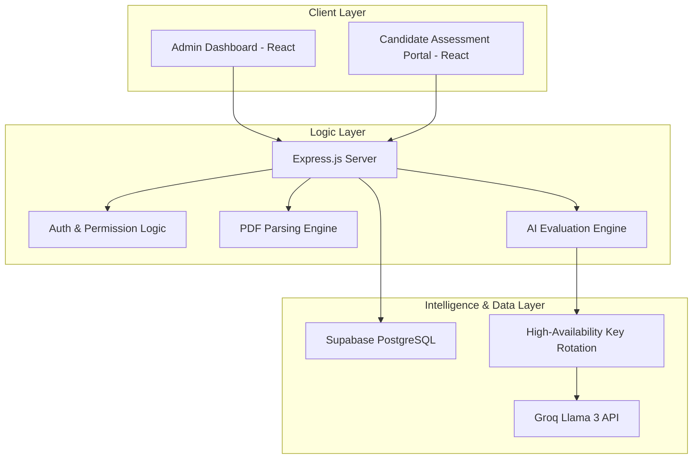
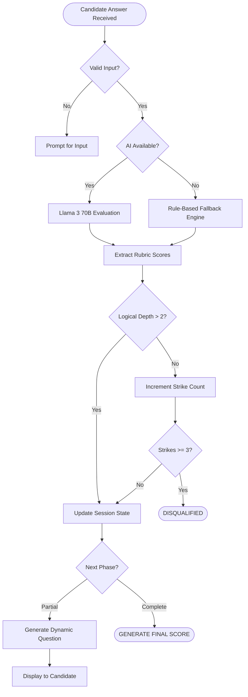
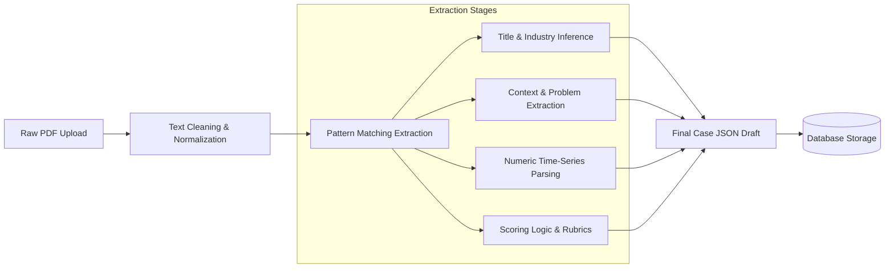
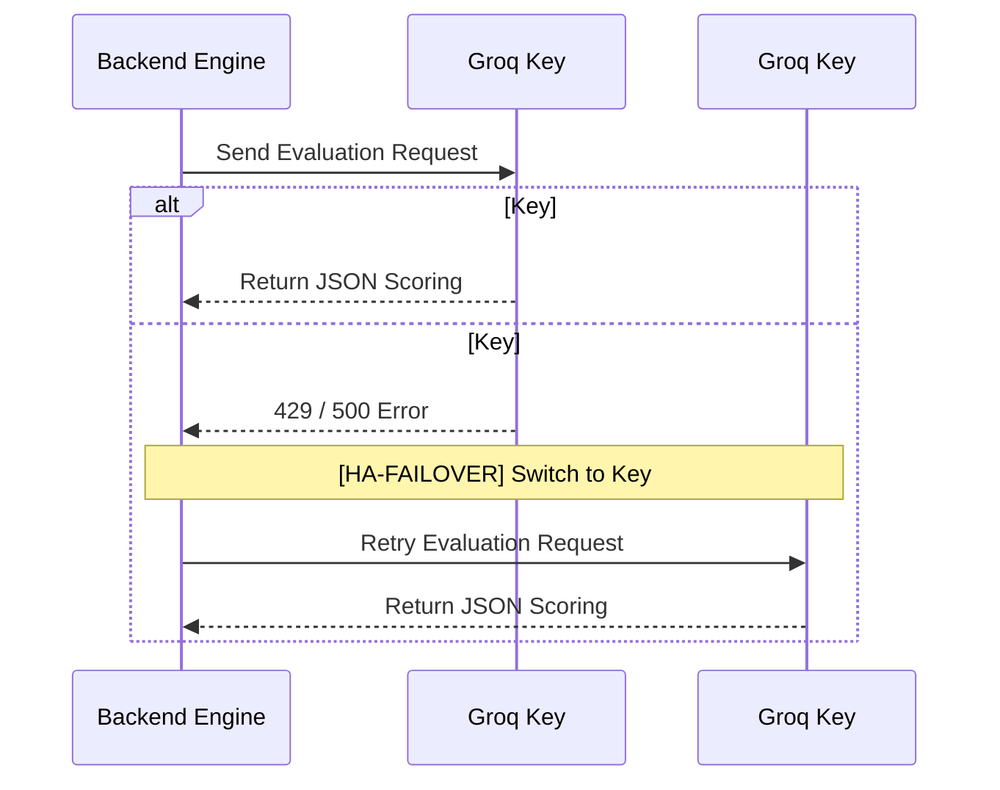

# AI-Powered Consultant Evaluation Platform

An elite, AI-driven assessment engine designed to evaluate management consultants through high-fidelity, live case study interviews. The platform automates the end-to-end recruitment funnel—from case creation via PDF parsing to real-time conversational evaluation using advanced Large Language Models.

> "Scaling elite talent identification through sovereign AI intelligence."

---

## System Architecture & Flow

### 1. High-Level Architecture (C4 Model)
The platform is built on a decoupled architecture ensuring separation of concerns between candidate experience, administrative management, and AI intelligence.



---

### 2. AI Interview & Evaluation Logic
The core of the platform is a sophisticated evaluation loop that handles candidate input, assesses logic depth, and manages session state (including disqualifications).



---

### 3. PDF Data Extraction Pipeline
Admins can upload case PDFs which are processed through a multi-stage extraction pipeline to build structured interactive assessments.



---

### 4. High-Availability (HA) AI Failover
To prevent interview interruption, the platform implements a round-robin rotation for AI API keys.



---

## Core Capabilities

### AI Interview Engine
*   **Live Conversational Assessment**: Conducts real-time, multi-step interviews using **Llama 3.3 (70B)** via Groq.
*   **Adaptive Follow-ups**: The AI dynamically generates probing questions based on candidate responses.
*   **Phase-Based Logic**: Interviews proceed through logical consulting phases: `Diagnostic`, `Brainstorming`, `Calculations`, and `Recommendation`.

### Intelligent Case Management
*   **PDF-to-Case Parser**: Automatically transforms standard consulting case PDFs into structured assessments.
*   **Domain Agnostic**: Supports diverse industries including **FinTech**, **SaaS**, **D2C**, and **Banking**.

### Comprehensive Evaluation & Scoring
*   **5-Metric Rubric**: Candidates are scored on Problem Understanding, Data Usage, Root Cause Identification, Solution Quality, and Consistency.
*   **Strike System**: Automated disqualification for generic or low-depth responses (3-strike limit).

---

## Tech Stack
*   **Frontend**: React.js, Vite, Vanilla CSS.
*   **Backend**: Node.js, Express.
*   **AI/LLM**: Groq SDK (Llama 3.3 70B Versatile).
*   **Database**: Supabase (PostgreSQL).
*   **Storage**: Multer (In-memory buffer).

---

## Installation & Setup

### 1. Environment Configuration
Create a `.env` file in the `backend/` directory:
```env
PORT=5000
SUPABASE_URL=your_supabase_url
SUPABASE_ANON_KEY=your_supabase_anon_key
GROQ_API_KEY_1=your_primary_groq_key
GROQ_API_KEY_2=your_backup_groq_key
```

### 2. Database Setup
Execute the SQL found in [`backend/schema_v2_evaluation.sql`](file:///backend/schema_v2_evaluation.sql) inside your Supabase SQL Editor.

### 3. Unified Development Launch
```bash
npm run install-all
npm start
```